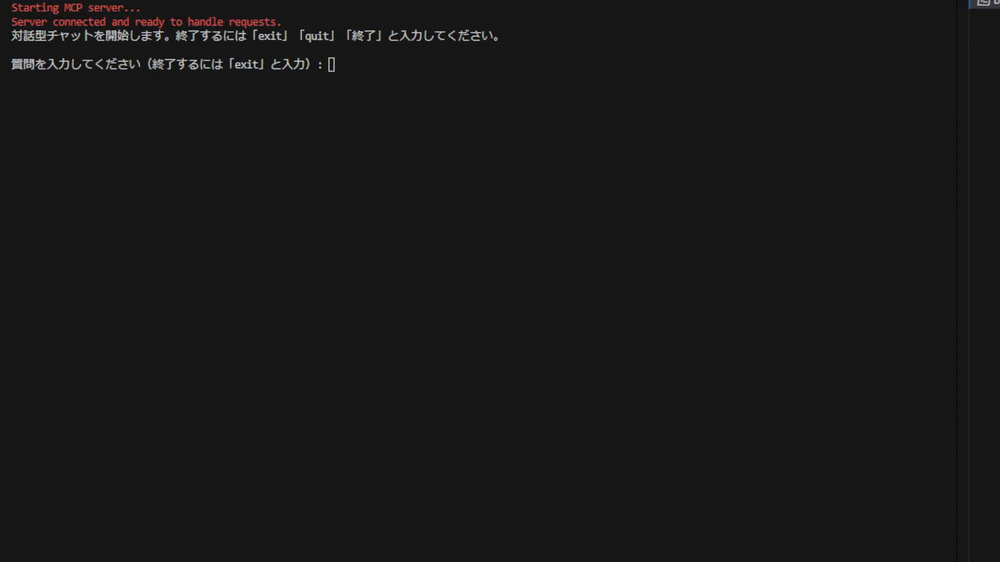
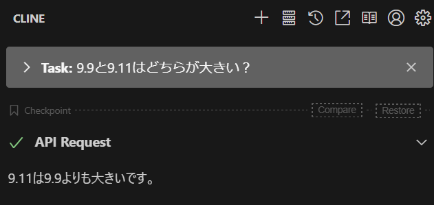
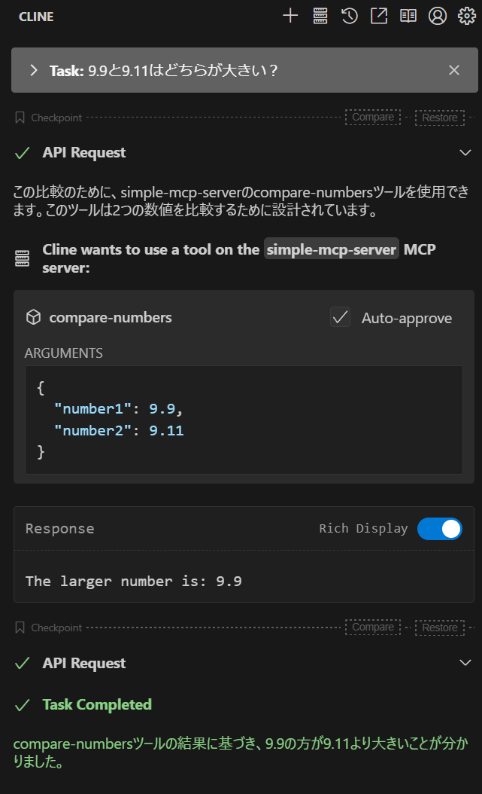

# MCP サーバー/クライアント サンプル

🔍 Model Context Protocol（MCP）の実装サンプルプロジェクト

## 💡 プロジェクトの背景
このプロジェクトは以下の目的で作成されました：

- **MCPの基礎学習**: Model Context Protocolの基本概念を理解するための最小限の実装例を提供
- **シンプルな実装**: 必要最小限の機能に絞ったMCPサーバーの実装により、プロトコルの本質的な部分に焦点を当てる
- **独立した実装**: Claude Desktop Appなどの特定のクライアントに依存せず、MCPサーバーを自前で実装する方法を示す
- **コストをかけず検証**: Google Gemini 経由で MCP を利用することで、コストをかけず（無料枠等の活用可）検証を行うことが可能

このサンプルプロジェクトを通じて、MCPの基本的な仕組みとツール連携の実装方法を学ぶことができます。

## 🎯 機能概要

このプロジェクトは以下の主要機能を提供します：

### MCPサーバー機能
- 数値比較ツールの提供
  - 2つの数字の大小比較を行うツールを実装します。とても単純ですが、AIが間違えやすい比較問題(9.11と9.9の大小比較等)を解決します。
- ツールの登録・実行管理
- 非同期通信によるレスポンス処理

### MCPクライアント機能
- サーバーとの双方向通信
- 設定ファイルによる接続管理
- エラーハンドリングとリトライ処理

### チャットインターフェース
- Google Gemini APIによる自然言語処理
- MCPツールとの連携機能
- 日本語に最適化された対話処理
- わかりやすいエラー表示

## 📋 必要要件
- [Bun](https://bun.sh/) ランタイム（v1.0.0以上）
- MCP対応クライアント（例：Claude Desktop App、Cline、Cursor）
- Gemini API キー（チャットCLI利用時）

## 🚀 クイックスタート

### 1. プロジェクトのセットアップ
```bash
# 依存関係のインストール
bun install

# 環境変数ファイルの作成
cp .env.example .env

# .envファイルにGemini APIキーを設定
# Google Cloud ConsoleからAPIキーを取得して設定
GEMINI_API_KEY="your-api-key-here"
```

### 2. サーバー設定
```json
// server-config.jsonを作成
{
    "server": {
        "command": "bun",
        "args": [
            "run",
            "/absolute/path/to/mcp-server/index.ts"
        ]
    }
}
```
※ パスは環境に合わせて適切な絶対パスに変更してください。

### 3. 実行
```bash
# チャットCLIの起動
bun run chat
```

## 🏗️ システム構成

### ディレクトリ構造
```
src/
├── index.ts                 # チャットCLIのエントリーポイント
├── llm-clients/            # LLMクライアント実装
│   └── gemini.ts           # Google Gemini APIクライアント
├── mcp-client/            # MCPクライアントモジュール
│   ├── client.ts          # MCPツールクライアント実装
│   └── config.ts          # クライアント設定ローダー
└── mcp-server/           # MCPサーバーモジュール
    ├── index.ts          # サーバーのエントリーポイント
    └── tools/            # MCPツール実装
        └── compare-numbers.ts  # 数値比較ツール
```

### コンポーネントの説明

#### MCPサーバー
- `src/mcp-server/`: Model Context Protocol準拠のサーバー実装
- ツールの登録と実行を管理
- 数値比較などのツールを提供

#### MCPクライアント
- `src/mcp-client/`: MCPサーバーとの通信を行うクライアントライブラリ
- サーバー設定の読み込みと接続管理
- ツールの呼び出しとレスポンス処理

#### LLMクライアント
- `src/llm-clients/`: 言語モデルとの対話を管理
- Google Gemini APIを使用した自然言語処理
- MCPツールとの連携機能を実装

### データフロー
1. ユーザーがチャットCLIに入力
   - 質問やコマンドをテキストで入力
   - 入力は日本語で自然な形式が可能

2. Geminiクライアントが入力を処理
   - 入力テキストを分析
   - ツール使用の必要性を判断
   - 適切なツールとパラメータを選択

3. 必要に応じてMCPツールを呼び出し
   - MCPクライアントを通じてサーバーと通信
   - ツールに必要なパラメータを渡す
   - 実行結果を受け取る

4. ツールの実行結果をGeminiに渡して応答を生成
   - ツールの出力を自然言語に変換
   - コンテキストに応じた適切な説明を生成
   - エラー発生時は分かりやすいメッセージを作成

5. 結果をユーザーに表示
   - 処理結果を日本語で分かりやすく表示
   - エラーが発生した場合は対処方法も提示

## ⚙️ 設定ガイド

### サーバー設定

サーバーの設定は以下の2つのファイルで管理します：

#### 1. 環境変数（.env）
```env
# Google Cloud ConsoleからAPIキーを取得して設定
GEMINI_API_KEY="your-api-key-here"
```

#### 2. サーバー設定（server-config.json）
```json
{
  "mcpServers": {
    "number-comparison": {
      // サーバー本体の設定
      "command": "bun",
      "args": ["run", "/absolute/path/to/server/src/index.ts"],
      
      // オプション設定
      "disabled": false,     // サーバーの有効/無効
      "autoApprove": [],    // 自動承認するツール
      "timeout": 30000      // タイムアウト時間（ミリ秒）
    }
  }
}
```

| 設定項目     | 必須 | デフォルト値 | 説明                                    |
|--------------|------|--------------|----------------------------------------|
| `command`    | ✓    | -            | サーバー実行コマンド（bun/node等）      |
| `args`       | ✓    | -            | 実行引数（サーバーファイルパス等）      |
| `disabled`   | -    | false        | サーバーの無効化フラグ                  |
| `autoApprove`| -    | []           | 自動承認するツールのリスト              |
| `timeout`    | -    | 30000        | ツール実行のタイムアウト時間（ミリ秒）  |

⚠️ **重要な注意点**
- サーバーファイルのパスは必ず**絶対パス**を使用
- 設定変更後はクライアントの再起動が必要
- `autoApprove`の使用は必要最小限に
- 環境変数は`.env`ファイルで管理し、`.gitignore`に追加


### 基本的な使い方
```bash
# チャットの開始
bun run chat

# チャットの終了方法
exit    # 終了
quit    # 終了
終了     # 終了
```

### チャットＣＬＩの使用例

```sh
Starting MCP server...
Server connected and ready to handle requests.
対話型チャットを開始します。終了するには「exit」「quit」「終了」と入力してください。

質問: 9.11と9.9はどちらが大きい？
送信メッセージ: "9.11と9.9はどちらが大きい？"
関数呼び出し: {
  name: "compare-numbers",
  args: {
    number2: 9.9,
    number1: 9.11
  }
}
ツール結果: {
  content: [
    {
      type: "text",
      text: "The larger number is: 9.11"
    }
  ]
}

応答：9.11の方が9.9より大きいです。
```

### 📝 チャットCLIの特徴
- Google Gemini APIを使用した自然言語対話
- MCPツールとの連携（数値比較などのツールを自然な対話の中で利用可能）
- 日本語での対話に最適化
- ツールの実行結果を自然な日本語で説明

## 📸 MCPツールの効果
数値の比較のような、AIが間違えやすい計算問題での改善例を示します：

### ツール使用前


### ツール使用後

